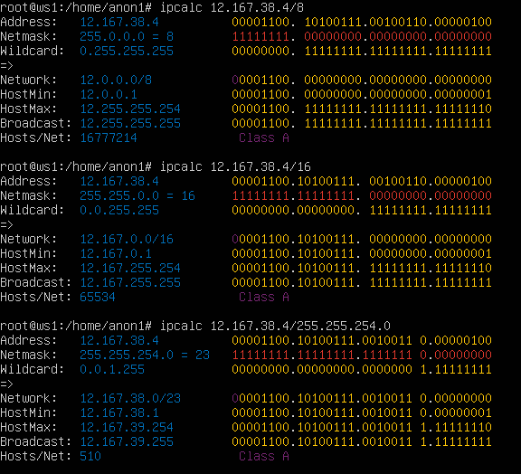
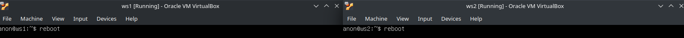
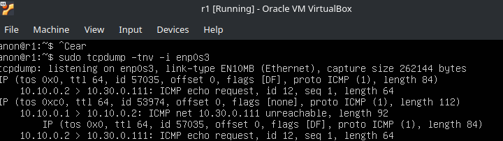
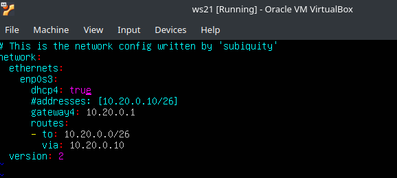

## Part 1. ipcalc tool
### 1.1 Networks and masks
### Находим необходимые данные с помощью команды ipcalc:

* Network address: `192.160.0.0`

### Маска `255.255.255.0`:

* В бинарном виде: `11111111.11111111.11111111. 00000000`

* В префиксном виде: `/24`

### Маска `/15`:

* В десятеричном виде: `255.254.0.0`

* В двоичном виде: `11111111.11111110.00000000. 0000000`

### Маска `11111111.11111111.11111111.11110000`:

* В десятеричном виде: `255.255.255.240`

* В префиксном виде: `/28`

### Нахождение диапазонов айпи для разных масок:

### Для `/8`:

* HostMin: `12.0.0.1`

* HostMax: `12.255.255.254`

###  Для `11111111.11111111.00000000.00000000` (на скриншоте `/16` поскольку ipcalc не принимает бинарные маски):

* HostMin: `12.167.0.1`

* HostMax: `12.167.255.254`

### Для `255.255.254.0`:

* HostMin: `12.167.38.1`

* HostMax: `12.167.39.254`

### Для `/4`:

* HostMin: `0.0.0.1`

* HostMax: `15.255.255.254`

### 1.2 Localhost

По стандарту RFC (https://www.rfc-editor.org/rfc/rfc3330):

`127.0.0.0/8 - This block is assigned for use as the Internet host loopback address. A datagram sent by a higher level protocol to an address anywhere within this block should loop back inside the host. This is ordinarily implemented using only 127.0.0.1/32 for loopback, but no addresses within this block should ever appear on any network anywhere [RFC1700, page 5].`

* Таким образом, смотря на диапазон:

1. `194.34.23.100` - не может ссылаться на loopback

2. `127.0.0.2` - ссылается на loopback

3. `127.1.0.1` - ссылается на loopback

4. `128.0.0.1` - не может ссылаться на loopback

### 1.3 Network ranges and segments

* Диапазон локальных адресов:

1. `10.0.0.0` до `10.255.255.255`

2. `172.16.0.0` до `172.31.255.255`

3. `192.168.0.0` до `192.168.255.255`

Следовательно:

 |IP| Локальный/внешний|
 |---------|------------------|
 |`134.43.0.2` |внешний адрес|
 |`192.168.4.2` | внутренний адрес
 |`172.20.250.4`|  внутренний адрес
 |`172.0.2.1` |внешний адрес
 |`192.172.0.1` | внешний адрес
 |`172.68.0.2` | внешний адрес
 |`172.16.255.255`|  внутренний адрес
 |`10.10.10.10` | внутренний адрес
 |`192.169.168.1`| внешний адрес

* Исполнение команды ipcalc для подтверждения:

* Для `10.10.0.0/18` возможные шлюзы:

1. `10.10.0.2` - находится в диапазоне

2. `10.10.10.10` - находится в диапазоне

3. `10.10.1.255` - находится в диапазоне

## Part 2. Static routing between two machines

* Клонируем виртуальную машину от ws1  и называем ее ws2:

### Меняем тип адаптера машин на Internal Network:

### Команда `ip a` для обоих виртуальных машин:

* Адаптер сети которые относится к внутренней сети для обоих машин - `enp0s3`
* IP адрес машин временно пустует из-за отсутствия DHCP сервера и конфигурации.

### Меняем содержимое файла `/etc/netplan/00-installer-config.yaml` для обоих машин

### Используем `netplan apply` для применения конфигурации и проверяем чтобы IP адреса поменялись. Успешно:

### Командой ip r add прописываем для виртуальных машин руты друг до друга:

### Пингуем

### Ребутаем машины

### После ребута проставляем пути вручную через конфиг и используем `netplan apply`, после чего пингуем

## Part 3. iperf3 utility

* `8 mbps` = `1 MB/s`

* `100 MB/s` = `800,000 Kpbs`

* `1 Gbps` = `1000 Mbps`

### Тестирование скорости:

* `ws1` как сервер iperf3:

* `ws2` как сервер iperf3:

## Part 4. Network firewall

### Создаем и заполняем необходимые shell скрипты:

### Запускаем

    Разница между стратегиями размещения правил "запрета" вверху или "разрешения" вверху в конфигурации брандмауэра iptables заключается в том, как брандмауэр оценивает правила и общем подходе к управлению брандмауэром:

    Правила "запрета" вверху:
    В этой стратегии брандмауэр начинает с политики "запретить все" по умолчанию, а затем добавляются конкретные правила "разрешения" для разрешения желаемого трафика.
    Правила "запрета" размещаются в верхней части набора правил, обеспечивая, что любой трафик, который не соответствует последующим правилам "разрешения", автоматически блокируется.
    Этот подход часто считается более безопасным, так как он блокирует весь трафик по умолчанию и разрешает только конкретный, авторизованный трафик.
    Он может быть проще в управлении и обслуживании, так как поведение по умолчанию - блокировать все, и вам нужно добавлять правила только для трафика, который вы хотите разрешить.
    Однако это может потребовать добавления большего количества правил по мере появления новых служб или приложений, так как для каждой новой службы или приложения потребуется явное правило "разрешения".

    Правила "разрешения" вверху:
    В этой стратегии брандмауэр начинает с политики "разрешить все" по умолчанию, а затем добавляются конкретные правила "запрета" для блокирования нежелательного трафика.
    Правила "разрешения" размещаются в верхней части набора правил, обеспечивая, что любой трафик, соответствующий правилам "разрешения", будет пропущен.
    Этот подход может быть более удобным для быстрой настройки брандмауэра, так как поведение по умолчанию - разрешить весь трафик, и вам нужно добавлять правила только для трафика, который вы хотите заблокировать.
    Это может потребовать меньшего количества правил по мере появления новых служб или приложений, так как поведение по умолчанию - разрешить все, и вам нужно добавлять только правила "запрета" для трафика, который вы хотите заблокировать.
    Однако этот подход, как правило, считается менее безопасным, так как он разрешает весь трафик по умолчанию и полагается на правила "запрета" для блокирования нежелательного трафика.

### nmap utility

* Находим машину которая не пингуется: (`192.168.100.1`)

* Используем nmap на ws2 для того чтобы подтвердить что хост действительно существует

* Сохраняем дампы виртуальных машин

## Part 5. Static network routing

### Результат настройки и конфиги всех машин

          r1 — r2
          /    | \
        ws11 ws22 ws21
 

### Используем `netplan apply на всех машинах`

### Выполнение команды `ip -4 a` на всех машинах

### Пинг `ws22` (`10.20.0.20`) с `ws21`

### Пинг `r2` (`10.10.0.1`) с `ws21`

### Включаем проброс IP на `r1` и `r2` командой

### Включаем проброс через конфиг:

### Меняем default конфигурацию для ws-ов

### Проверяем `default` через ip r

### Смотрим пинги с ws1 (`10.10.0.2`) до r2 (`10.100.0.12`):

### Добавляем статические маршруты для `r1` и `r2`

### Результат работы команды `ip r` для `r1` и `r2`

### Результат работы команд  `ip r list 10.10.0.0/18` и `ip r list 0.0.0.0/0` для `ws11`

    Маршрут был выбран отличный, поскольку процесс оценки маршрута в каждом маршрутизаторе использует метод совпадения самого длинного префикса для получения наиболее точного маршрута. Сеть с самой длинной маской подсети или префиксом сети, которая соответсвует целевому ip-адресу, является сетевым шлюзом следующего перехода. Процесс повторяется до тех пор, пока пакет не будет доставлен на хост назначения. Если вкратце, при наличии двух и более маршрутов выбирается маршрут с самой длинной маской т.к. он более точный

### Результат работы команды traceroute для `ws11` до `ws21`:

### Tcpdump на `r1`

    Процесс построения пути с помощью traceroute работает путем отправки серии пакетов UDP или ICMP с увеличивающимися значениями Time-To-Live (TTL). В нашем случае отсылаются 3 пакета. Вот пошаговое объяснение того, как traceroute строит путь:

    1. Начальная передача пакета:

    Traceroute начинает с отправки первого пакета с значением TTL, равным 1.
    Этот пакет адресован к конечному IP-адресу, но исходный порт установлен на высокий, неиспользуемый номер порта (например, 33434).

    2. Ответ маршрутизатора:

    Когда пакет с TTL=1 достигает первого маршрутизатора, маршрутизатор уменьшает TTL до 0 и отправляет обратно сообщение ICMP "Time Exceeded".
    Сообщение ICMP содержит IP-адрес маршрутизатора, который отправил ответ.

    3. Пересылка пакета:

    Traceroute записывает IP-адрес первого маршрутизатора, а затем отправляет следующий пакет с TTL, равным 2.
    Этот процесс продолжается, при этом каждый последующий пакет имеет TTL на единицу больше, чем предыдущий.

    4. Итеративный поиск:

    Traceroute продолжает отправлять пакеты с увеличивающимися значениями TTL, записывая IP-адреса маршрутизаторов, которые отвечают сообщениями ICMP "Time Exceeded".
    Этот итеративный поиск позволяет traceroute построить путь, собирая IP-адреса маршрутизаторов по пути.

    5. Достижение пункта назначения:

    Когда пакет с достаточно высоким значением TTL наконец достигает пункта назначения, хост-получатель отвечает сообщением ICMP "Port Unreachable".
    Traceroute интерпретирует этот ответ как последний хоп на пути.
    Собранные IP-адреса маршрутизаторов, которые отвечают сообщениями ICMP "Time Exceeded", являются хопами на пути, и traceroute отображает их в порядке, в котором они были обнаружены.

### Пингуем несуществующий айпи с `ws11`:

### Результат работы команды `tcpdump -n -i eth0 icmp` на `r1`:

## Part 6. Dynamic IP configuration using DHCP

### Редактируем `/etc/dhcp/dhcpd.conf` у `r2`:

### Редактируем `resolve.conf`:

### Перезагружаем сервис `dhcpd`: 

### Включаем `dhcp` у `ws21`

### Ребутаем `ws21`

### Видим что `ws21` получил адрес новый адрес `10.20.0.3`

### Пингуем новый адрес `ws21` с `ws11`

### Меняем Mac-адрес у `ws11` и выставляем `dhcp`

### Меняем конфигурацию DHCP у `r1`

* Выставляем так, чтобы выданному MAC адресу выдавался адрес `10.10.5.2`

### Меняем конфигурацию DNS в resolv.conf у машины которая даже (обычно) не подключена к интернету. Зачем? Не знаю. Надо? Надо.

### Перезапускаем службу и проверяем статус

### IP-адрес `ws11` до DHCP: `10.10.0.2`

### Просим у DHCP новый адрес и проверяем его. Обе команды равноценны для этого

* Новый адрес `ws1` - `10.10.5.2`. Это определенно победа, ~~особенно после 3.5 часов мучений, начинаний сначала и битья головой об стену только на ЭТОМ подпункте. Пойду вскроюсь~~.

* Какие опции DHCP сервера были использованы:

* routers (option 3) - указывает адрес шлюза
* domain-name-servers (option 6) - адрес DNS сервера

## Part 7. NAT

### Настраиваем apache2 сервер для `r1` и `ws22`

### Запускаем

### Добавляем нужные опции файрвола:

### Проверка работы файрволла. Как и надо, `ws22` не пингуется с `r1`

### Добавляем пропуск для ICMP пакетов:

### Теперь пинги работают

### Добавляем обработку SNAT и DNAT для r2:

### Проверяем работу SNAT и DNAT

* Стучимся до apache-сервера `r1` с `ws22`

* Стучимся до apache-сервера `ws22` с `r1`

* Результат работы `GET /index.html`, стучимся до скрытого за NAT `ws22` с `r1`

* `GET /index.html` с апач-сервер на `r1`

## Part 8. Bonus. Introduction to SSH Tunnels

### Используем те же правила iptables для `r2` что и в предыдущем пункте

### Меняем конфигурацию `apache2` на `ws22` согласно заданию

     Клиенты за NAT не видят друг друга. Для того чтобы наша многоходовочка сработала, можно использовать сервер-посредник, который через ssh туннелирование будет перенаправлять трафик между клиентами
     В качестве этого сервера я буду использовать `ws11`, не скрытый за NAT.

### Пробрасываем порт 80 с `ws22` до `ws11` (8080)

### Проверяем доступность апач-сервера с ws11, успешно

### С ws21 прокидываю себе порты от ws11 к себе:

### Переключаюсь через `CTRL + ALT + F2` на tty2

### Пробуем сделать запрос на проброшенный порт

